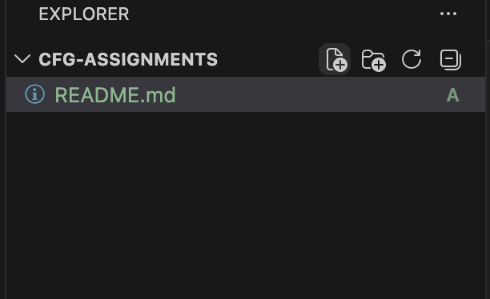
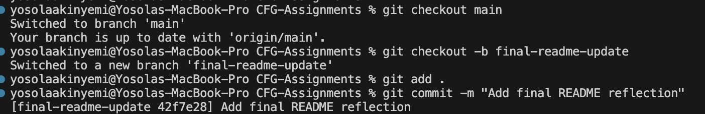
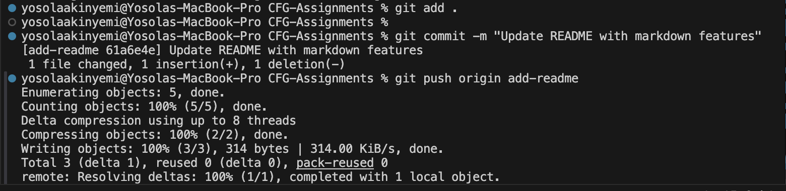
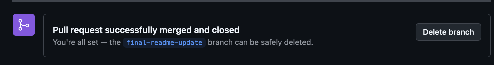
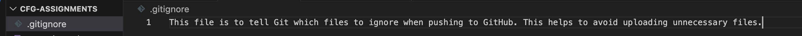
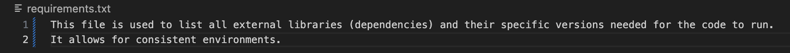

# CFG Assignment 1 

## 🌸 About Me
Hi, my name is **Adeyosola Akinyemi** and I am currently learning Git and GitHub which is required for the CFG *Software Engineering* stream.

## 🌸 What I Am Learning
- How To Create Repositories
- How To Create A Read Me File
- How To Use Branches
- How To Commit Changes

## 🌸 Git Workflow
1. Created a new branch using 'git checkout -b add-readme'
2. Added files using 'git add .'
3. Committed changes using 'git commit'
4. Pushed changes using 'git push'
5. Opened a pull request on GitHub
6. Merged changes into the main branch
7. Create .gitignore file
8. Create requirements.txt

 ### :star: I am really excited and I <ins>can't wait</ins> to learn more! :star: ###

> Reflection: This assignment is helping me to understand GitHub and Git. At first, I was a bit confused but the more I did it, the more I got the hang of it. This was actually enjoyable.

### Resources
[GitHub Markdown Guide](https://docs.github.com/en/get-started/writing-on-github/getting-started-with-writing-and-formatting-on-github/basic-writing-and-formatting-syntax)

### 📸 Screenshots
### Creating The README File

### Creating A Branch

### Committing And Pushing Changes

### Merging Pull Request Into Main Branch

### Creating Gitignore File

### Creating Requirements.txt File

>Completed Assignment On 22/03

